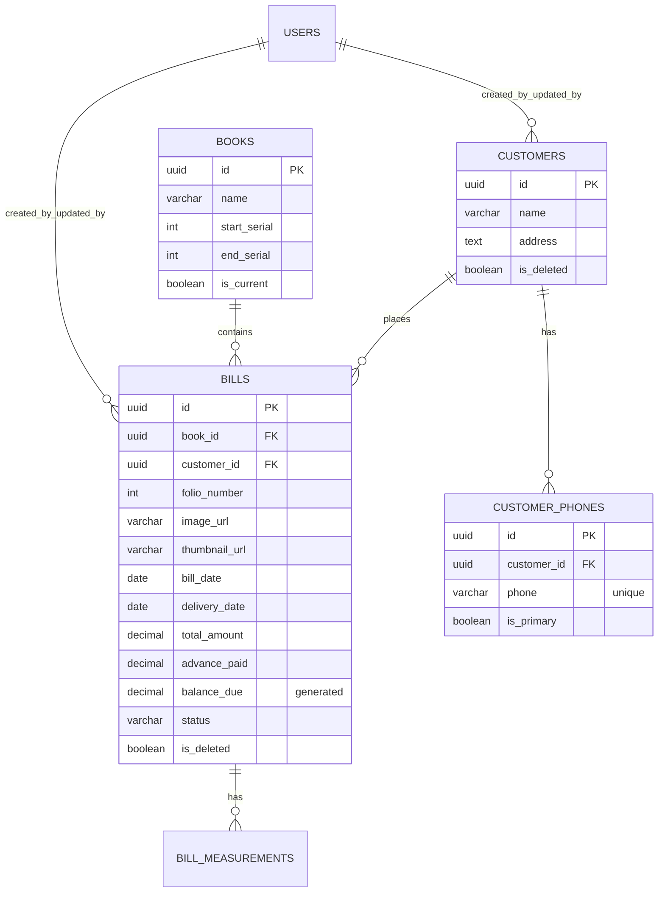
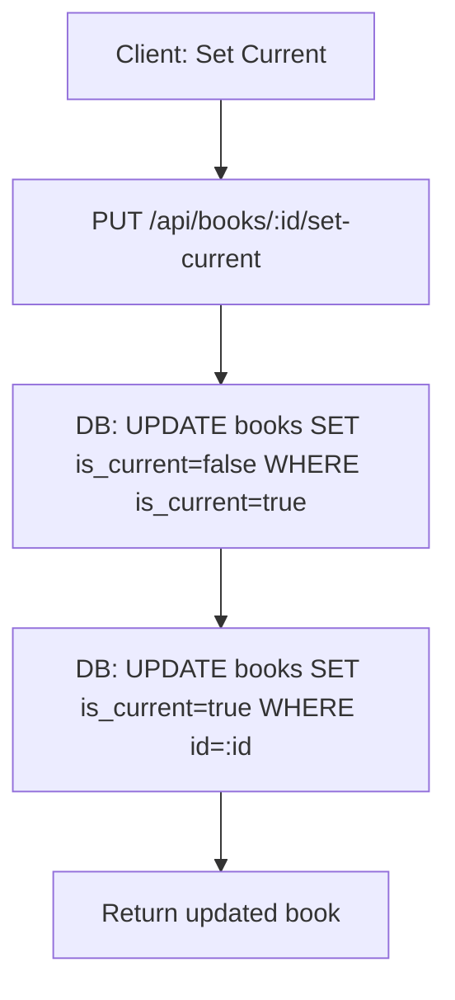

# Eagle Tailors — Backend Workflows Reference

This document explains (1) how **Books** are stored, (2) how they relate to **Bills** and **Customers**, and (3) the end-to-end workflow for saving and retrieving records.

Scope: current repo state (schema + backend API), with examples that are directly implementable.

---

## 1) Mental model (simple)

- A **Book** is a *physical ledger register* (a real-world book) with a folio/serial range.
- A **Bill** is a *single order entry* written on one folio page in a specific Book.
- A **Customer** can have multiple phone numbers.
- Each Bill belongs to exactly **one Book** and exactly **one Customer**.

In practice:
- You keep exactly **one “current book”** active for daily entries.
- Each new bill gets a **folio number unique inside that book**.

---

## 2) Data model (tables + relations)

Source of truth: `Eagle_tailors/database/migrations/001_initial_schema.sql`

### Key tables

- `books`
  - `id` (UUID)
  - `name`
  - `start_serial`, `end_serial` (folio range; `end_serial` can be NULL/open-ended)
  - `is_current` (boolean)
- `bills`
  - `id` (UUID)
  - `book_id` → `books.id`
  - `customer_id` → `customers.id`
  - `folio_number` (int)
  - `image_url`, `thumbnail_url` (stored file paths under `/uploads/...`)
  - `bill_date`, `delivery_date`, `actual_delivery_date`
  - `total_amount`, `advance_paid`, `balance_due` (computed: `total_amount - advance_paid`)
  - `status` (pending/cutting/stitching/ready/delivered/cancelled)
  - `extraction_status`, `raw_extraction` (reserved for OCR/manual extraction)
  - `is_deleted` (soft delete)
- `customers`
  - `id` (UUID)
  - `name`, `address`, `notes`
  - `is_deleted` (soft delete)
- `customer_phones`
  - `customer_id` → `customers.id` (ON DELETE CASCADE)
  - `phone` (globally unique across all customers)
  - `is_primary`

### ER diagram



---

## 3) Integrity rules (what keeps data consistent)

### A) Only one current Book

DB constraint:
- Unique partial index: only one row can have `is_current = true`.

Implementation detail:
- On `BookModel.create({ isCurrent: true })` the code sets all other books to `is_current = false` before insert.
- On `BookModel.setCurrent(id)` the code unsets all current books and then sets the chosen one.

### B) Folio number is unique per Book

DB constraint:
- `UNIQUE (book_id, folio_number)` on `bills`.

Behavior:
- If you try to insert the same folio again in the same book, the API returns `409` with `Folio number already exists in this book`.

### C) Soft delete is used for Bills and Customers

- `bills.is_deleted = true` hides the bill from most reads.
- `customers.is_deleted = true` hides the customer from most reads.
- `books` are hard-deleted but only allowed if there are no related bills.

### D) Audit log exists (partial)

- `audit_log` table is present.
- Triggers are applied for `customers` and `bills` (create/update/delete).

---

## 4) Workflow: Book lifecycle

### Create a book

Endpoint:
- `POST /api/books`

Accepted request body:
- `name`
- `startSerial` or `start_serial`
- `endSerial` or `end_serial` (optional)
- `isCurrent` or `is_current` (optional)

Flow:

```mermaid
flowchart TD
  A[Client: Create Book] --> B[POST /api/books]
  B --> C{isCurrent true?}
  C -- yes --> D[DB: UPDATE books SET is_current=false WHERE is_current=true]
  C -- no --> E[Skip]
  D --> F[DB: INSERT books(...)]
  E --> F
  F --> G[Return created book row]
```

### Set current book

Endpoint:
- `PUT /api/books/:id/set-current`

Flow:



### Delete a book

Endpoint:
- `DELETE /api/books/:id`

Rule:
- Allowed only if **no bills exist** referencing that book.

---

## 5) Workflow: Bill creation (how a bill is saved)

### UI-style preflight (how the app decides what to save)

This is the typical “operator flow” before the actual `POST /api/bills` call:

```mermaid
flowchart TD
  A[Open Upload Bill screen] --> B[GET /api/books/current]
  B --> C[Show current book + suggest next folio]
  C --> D[Operator types phone/name]
  D --> E[GET /api/customers/search?q=...&type=phone]
  E --> F{Customer found?}
  F -- yes --> G[Select customerId]
  F -- no --> H[Create customer flow]
  H --> I[POST /api/customers]
  I --> G
  G --> J[Operator uploads image + fills meta]
  J --> K[POST /api/bills (multipart)]
```

Endpoint:
- `POST /api/bills` (multipart/form-data)

Required fields (form-data):
- `image` (file)
- `bookId`
- `customerId`
- `folioNumber`

Optional fields:
- `billDate`, `deliveryDate`
- `totalAmount`, `advancePaid`
- `remarks`

### Bill save flow (including image processing)

```mermaid
flowchart TD
  A[Client: Upload Bill Form] --> B[POST /api/bills (multipart)]
  B --> C[middleware: multer memoryStorage]
  C --> D[middleware: sharp compress main image]
  D --> E[middleware: sharp generate thumbnail]
  E --> F[req.files paths set: /uploads/bills/... and /uploads/thumbnails/...]
  F --> G[controller: validate bookId/customerId/folioNumber]
  G --> H[DB: INSERT bills (book_id, customer_id, folio_number, image_url, ...)]
  H --> I[DB: SELECT bill detail join customer/book/phones/measurements]
  I --> J[Return complete bill JSON]
```

### Where images are stored (filesystem)

The upload middleware writes files to:
- `Eagle_tailors/uploads/bills/*.jpg`
- `Eagle_tailors/uploads/thumbnails/thumb_*.jpg`

Public URL paths stored in DB look like:
- `/uploads/bills/<uuid>.jpg`
- `/uploads/thumbnails/thumb_<uuid>.jpg`

Note: in this repo state, static serving is configured in `Eagle_tailors/backend/src/server.js` to serve `../../uploads` relative to `backend/src`, which resolves to `Eagle_tailors/backend/uploads` (but the middleware writes to `Eagle_tailors/uploads`). If you’re designing the backend, align these two to the same folder so the URLs in DB actually resolve.

---

## 6) Reading patterns (how data is retrieved)

### Get current book

- `GET /api/books/current`
- The backend returns book fields + aggregates:
  - `bill_count` (count of non-deleted bills)
  - `last_folio` (max folio_number among non-deleted bills)

### “Next folio” logic

Frontend behavior (current UI code path):
- next folio is computed as `(last_folio || start_serial - 1) + 1`.

Backend endpoint:
- `GET /api/books/:id/next-folio`

Important detail:
- `BookModel.getNextFolioNumber()` uses `MAX(folio_number) + 1` from **all bills in the book** (it does not filter `is_deleted`).
- If you soft-delete a bill, “next folio” may still skip past deleted folios.

### Bill detail (for a single bill page)

- `GET /api/bills/:id`
- Returns:
  - bill row
  - customer name/address + phones
  - book name
  - measurements (if bill_measurements rows exist)

---

## 7) Example (end-to-end)

Scenario: you start a new physical ledger “Book 2026”, create a customer, and upload Bill #1 into that book.

### Step 1 — Create a new Book and set it as current

Request:

```http
POST /api/books
Content-Type: application/json

{
  "name": "Book 2026",
  "start_serial": 1,
  "end_serial": 500,
  "is_current": true
}
```

Result:
- A new `books` row is inserted.
- Any previous `is_current=true` book is flipped to `false`.

### Step 2 — Create a Customer with a phone number

Request:

```http
POST /api/customers
Content-Type: application/json

{
  "name": "Amit Sharma",
  "address": "Indore",
  "phones": [{ "phone": "9876543210", "isPrimary": true }]
}
```

Result:
- `customers` row created
- `customer_phones` row created (phone must be globally unique)

### Step 3 — Upload the Bill image and metadata

Request (multipart fields):
- `image`: (the photo)
- `bookId`: `<book_uuid>`
- `customerId`: `<customer_uuid>`
- `folioNumber`: `1`
- `billDate`: `2026-04-26`
- `deliveryDate`: `2026-04-30`
- `totalAmount`: `1200`
- `advancePaid`: `500`
- `remarks`: `"2 shirts + 1 pant"`

Result:
- Image is saved + thumbnail created
- `bills` row inserted, with `image_url` and `thumbnail_url`
- `balance_due` is auto-computed by the database

### Step 4 — Retrieve the bill detail

Request:

```http
GET /api/bills/<bill_uuid>
```

Result contains (high level):
- `book_id`, `book_name`
- `customer_id`, `customer_name`, `customer_phones`
- `folio_number`
- `image_url`, `thumbnail_url`
- `total_amount`, `advance_paid`, `balance_due`
- `status` (defaults to `pending`)

---

## 8) Backend design checklist (if you’re implementing/rewriting)

- Keep DB constraints: single current book + unique folio per book.
- Choose one authoritative “next folio” rule and make UI + API consistent (including soft-deletes).
- Ensure `/uploads/...` URLs map to the same directory where middleware saves files.
- Consider storing `start_serial/end_serial` validations at write-time (e.g., folio must be in range).
- If you implement OCR persistence, update `bills.extraction_status/raw_extraction` and (optionally) insert `bill_measurements` rows in a transaction.
- If you need user attribution in `created_by/updated_by`, add auth middleware that sets `req.user` (today it is typically `undefined`, so those columns will be `NULL`).
